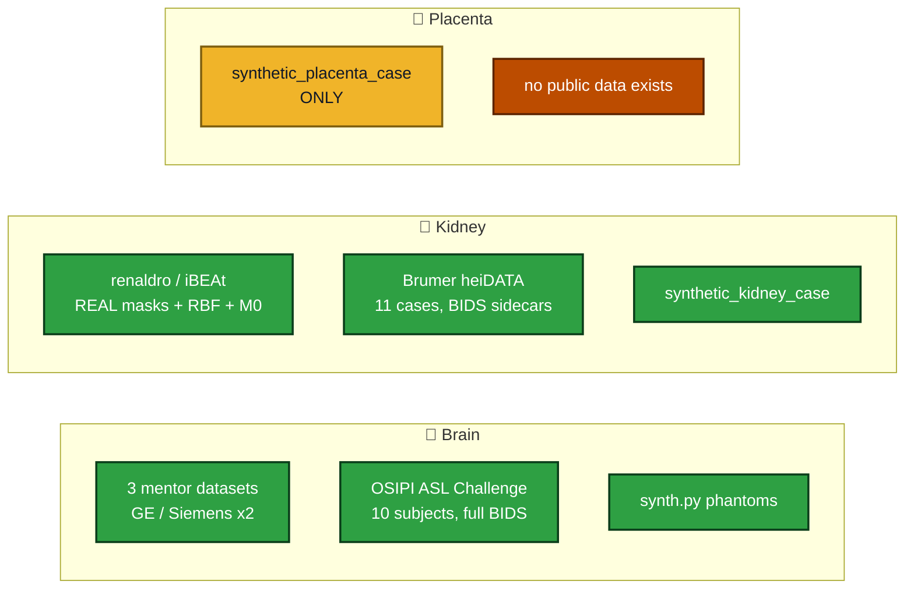

# 🔎 Public data for renal & placental ASL QC

### What exists, what does not, and what the toolbox was actually tested on
**A survey run while implementing the kidney and placenta modules**

---

## 🚨 The three findings that matter

> ### 1. There is **no open-source renal or placental ASL QC implementation anywhere.**
> Verified with the authenticated GitHub CLI, not web search. A repository search for
> `renal ASL` returns **exactly one** author's repos (AnneOyarzun), and those ship **no licence
> at all** — legally unusable. There is no placental equivalent. **This toolbox is the first.**

> ### 2. **None of the three reference ASL pipelines supports any non-brain organ.**
> Verified by grepping the full local clones in `reference_repos/`, case-insensitively, for
> `kidney|renal|placenta` across each entire repository:
> **ExploreASL** (754 MB) — no hits in any processing path. **ASLPrep** — brain only.
> **PyASL** — brain only. So there is nothing to extend and nothing to defer to.

> ### 3. **No public placental ASL data exists.**
> The only confirmed placental ASL study (FAIR-ASL at 1.5 T, 30 participants, fetal congenital
> heart disease) states its data is **not public**. **dHCP does not contain ASL** — its 4th
> release lists exactly "Structural, DTI, fMRI" for 783 neonatal + 273 fetal subjects. Every
> other placental MRI dataset found is **T2\*/BOLD/T2-weighted**, not perfusion.

---

## 🫘 Kidney — two usable datasets, both downloaded and tested

| Dataset | Licence | What it is | Used for |
|---|---|---|---|
| **renaldro** (Gold Standard Phantoms)  `github.com/gold-standard-phantoms/renaldro` | **MIT** | **Real anonymised kidney data from the iBEAt study.** `ASL_RBF.nii.gz` + `ASL_M0.nii.gz` (64×32×16, Siemens Prisma 3 T) and `Label_Map_cortex_medulla.nii.gz` (512×512×20; 1 = cortex 133 099 vox, 2 = medulla 30 756 vox) | Real mask-integrity testing; combined-label-map routing; grid-mismatch behaviour |
| **Brumer et al., synthetic renal ASL**  `doi.org/10.11588/data/QAHWSF` (heiDATA) | **CC BY 4.0** | 11 XCAT-derived datasets: 5 PASL + 5 pCASL healthy + **1 pCASL abnormal**. 96×96×1×51 (1 M0 + 25 pairs) with **full ASL-BIDS JSON sidecars** | End-to-end pipeline validation across 11 cases |

### What testing on them actually produced

Two metrics computed by the toolbox on data it had never seen landed **inside their published
reference ranges**:

| Metric | Toolbox, across 11 Brumer cases | Published |
|---|---|---|
| Cortical **PWS** (% of M0) | **2.65 – 4.20 %** | 2.95 ± 0.56 % (1.5 T), 3.09 ± 0.59 % (3 T) — *garciaruiz2025* |
| Cortical **tSNR** | **1.96 – 3.21** | 1.5 – 2.6 by readout; 3.33 ± 0.54 (3 T) — *harteveld2020 / garciaruiz2025* |

### Three real bugs the real data found

1. **The medulla is anatomically multi-component.** The real iBEAt medulla mask is ~8 separate
   renal pyramids per kidney (3899, 3754, 3127 … voxels). The "one dominant connected component"
   rule that is correct for a kidney and its cortex was flagging **every real medulla mask**.
   Fixed: component count is reported for the medulla, never graded.
2. **`BackgroundSuppression: 2`** — the Brumer sidecars carry an **integer pulse count** where
   BIDS types a boolean. Now read explicitly (0/False = off, ≥1/True = on), and a string is
   never guessed at.
3. **Label-first acquisitions.** Brumer's `ImageOrder` is `["label", "control"]`. Told the order,
   the swap check PASSes all 11; not told, it correctly reports the ordering as wrong on all 11.

### Also found, not used
- **iBEAt (BEAt-DKD)** — real multi-centre renal ASL, but **access by request**.
- **UKRIN-MAPS / UKAT** — renal MRI toolbox and DICOM parameter set; **no ASL images**.
- **TCIA renal collections, UK Biobank abdominal** — no ASL.
- **PARENCHIMA / renalmri.org** — a study registry, not a data archive.

---

## 🤰 Placenta — nothing with perfusion

Twenty leads checked. **Zero** placental ASL datasets are publicly downloadable.

| Lead | Verdict |
|---|---|
| **dHCP** 4th release | ❌ **No ASL.** Structural, DTI, fMRI only (783 neonatal + 273 fetal) |
| Placental **FAIR-ASL** study (fetal CHD, 1.5 T, n = 30) | ❌ The only confirmed placental ASL — **data not public** |
| **Placenta Accreta Spectrum** (Mendeley) | ⚠️ Open, has masks, but **2D PNG slices**, T2-weighted — not perfusion, not NIfTI |
| **MIT/Boston BOLD placenta segmentation** | ⚠️ **Code and weights only** — images not public |
| **KCL placental T2\*** (0.55/1.5/3 T) | ❌ "Not publicly available due to privacy reasons" |
| **FeTA**, CRL-2025, FaBiAN, spina bifida atlas | ⚠️ Fetal **brain**, T2-weighted — explicitly no placenta |
| **KCL fetal body atlas** | ⚠️ 10 organ ROIs, checked specifically — **no placenta label** |
| **FetReg2021** | ⚠️ Not MRI — optical fetoscopy video |
| **NICHD DASH** | ❓ Plausible route, no verifiable imaging study behind its JS-only search |

**Consequence for the project:** the placenta module is validated only against synthetic
phantoms with known answers. That is stated plainly in the module docstring and is not
presentable as validation on real data. **This is the single strongest argument for asking the
mentors directly for placental data** — and, since placental images are often unshareable for
ethics reasons, for the tool running fully locally so a site can send back only the report.

---

## 🧪 What the toolbox is therefore tested on

---

## 🔧 Synthetic generation, if we need more

**ASLDRO / MRImageTools** (Gold Standard Phantoms, MIT) ships **brain-only ground truths**, but
its engine is genuinely organ-agnostic — it takes perfusion / transit-time / M0 / T1 / T2 /
segmentation maps and produces ASL data from them. Driving it with a kidney or placenta geometry
is possible and is how the Brumer renal set was made. `asldro` on PyPI is dormant (2020); the
maintained code is **`gold-standard-phantoms/mr-image-tools`** (last commit 2026-04-29), which is
**not on PyPI** despite its README.

The toolbox's own `synth.py` needs none of that — its kidney and placenta phantoms are pure
NumPy, deliberately geometric rather than anatomical, and exist so every branch has a known
answer, not to model physiology.

---

## ❓ For the mentors

1. **Kidney:** is iBEAt access realistic for this project? It is the one real multi-centre renal
   ASL resource, and `renaldro` already ships a slice of it under MIT.
2. **Placenta:** no public placental ASL exists, so **any** map + mask you can share — even one
   case, even unshareable-but-run-locally — is the difference between a validated module and a
   module validated only against phantoms.
3. Should the toolbox ship the two open renal datasets as **example data** (both licences permit
   redistribution: MIT and CC BY 4.0), so a new user can run it without owning data?

*Survey run 2026-08-28 with 3 parallel research agents; every "verified-by-visiting" entry was
confirmed by loading the page or the API, and negative results are recorded so they are not
re-chased.*

