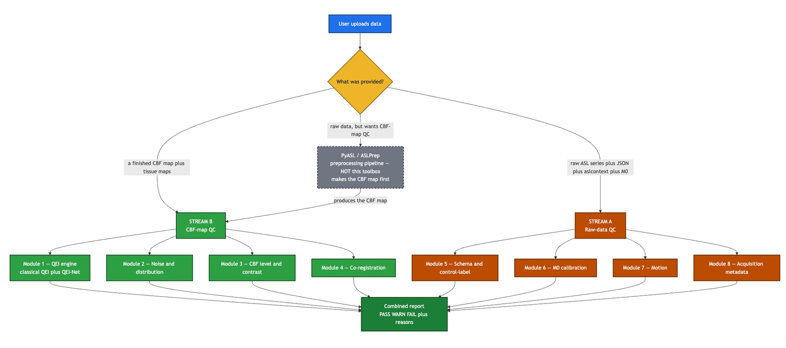
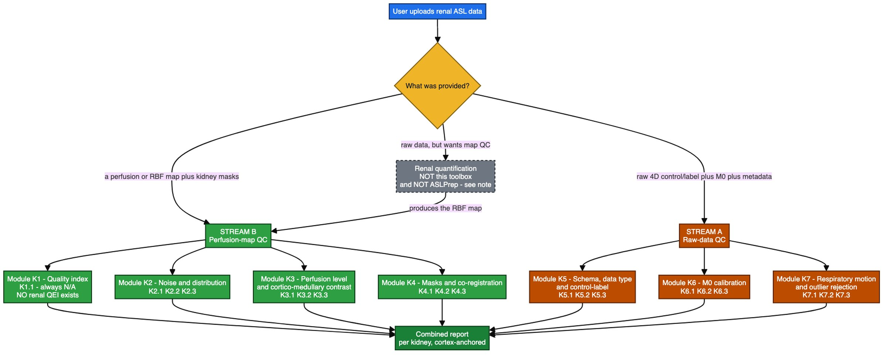
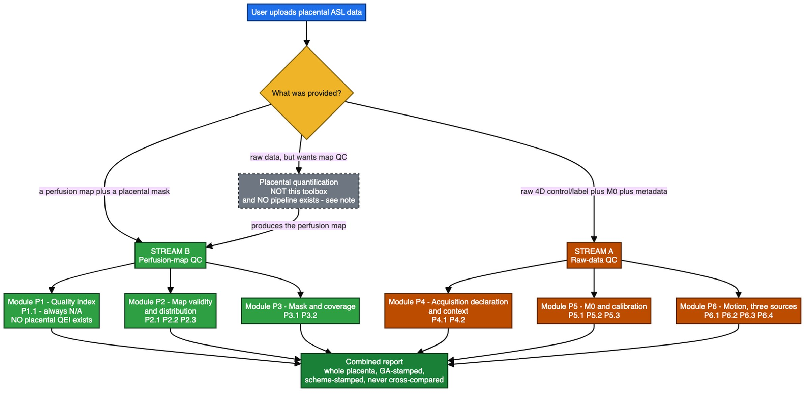
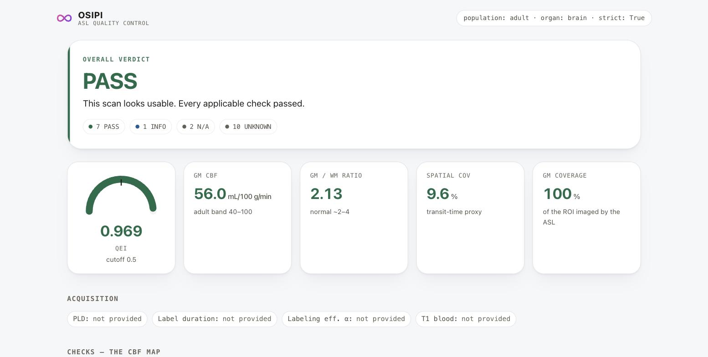

  
  &nbsp;&nbsp;&nbsp;
  

# GSoC 2026 final report: a quality control toolbox for ASL MRI

**Contributor** Agnik Misra  
**Mentors** María Mora Álvarez and Sudipto Dolui  
**Organisation** OSIPI, the Open Source Initiative for Perfusion Imaging  
**Period** May to September 2026

---

## What ASL is and why this matters

Arterial spin labelling, or ASL, is a way of measuring blood flow in tissue with an ordinary MRI scanner and no injected contrast. The scanner magnetically tags the water in arterial blood just before it enters the organ, waits a moment for that blood to arrive, and takes a picture. It then takes a second picture without the tag and subtracts one from the other. What is left is a map of how much blood reached each part of the tissue. With a reference scan and a little physics, that becomes a quantitative map of perfusion in millilitres per hundred grams per minute.

Because it needs no contrast agent, ASL can be added to a routine scan. That has made it the method of choice for measuring cerebral blood flow in large studies across many sites, where it serves as a marker of vascular health and of brain function in conditions from Alzheimer disease to stroke.

The difficulty is that the signal is tiny. The tagged blood changes the picture by only a percent or so, so the subtraction is noisy, and motion, a poorly chosen setting or an ordinary scanner imperfection can turn a perfusion map into an artefact that still looks like a map. In a study with hundreds of scans from several hospitals, somebody has to decide which maps can be trusted. Doing that by eye does not scale, and two experts looking at the same map do not always agree.

That is the gap this toolbox fills. It reads a perfusion map, runs a set of checks that each capture one way a scan can go wrong, and returns a verdict with the reason. It began with the brain, where a published quality index exists, and it extends the same structure to the kidney and the placenta, where ASL is used but no quality tool existed at all.

---

## What I built

I built a Python package that looks at an ASL scan and says whether it is usable. It gives every
check a verdict of PASS, WARN or FAIL, and it says why in a sentence a person can read. It covers
three organs. Brain, kidney and placenta.

Every threshold it grades against carries a record of where the number came from. Where no paper
has published a number yet, the report says so plainly rather than presenting a default as a fact.

It is a quality control layer and not a processing pipeline. It judges data and never changes it.
Making the CBF map, registering the images and correcting motion all belong to PyASL, ASLPrep or
oxford_asl. This toolbox sits after them and grades what they produced.

| | |
|---|---|
| **54** checks | 20 brain, 19 kidney, 15 placenta |
| **479** tests | known answer, across 28 files |
| **91** commits | 79 in the package, 12 in the design docs |
| **10,637** lines of source | and 5,956 lines of tests |
| **90** thresholds recorded | 12 published, 34 implementation, 44 uncalibrated |
| **3** organs | one registry, no branching at run time |

It runs on NumPy and nibabel. There is no scipy, no matplotlib and no web framework.

---

## How it fits together

The same shape serves all three organs. A user brings either a finished perfusion map or the raw
acquisition. Stream B grades the map. Stream A grades the acquisition it came from. Both feed one
report.

*Brain. Two streams and eight modules, holding 20 checks.*

*Kidney. Seven modules and 19 checks. Module K1 is the quality index slot and it is always marked
not applicable, because no renal quality index exists.*

*Placenta. Six modules and 15 checks. Nothing numeric is allowed to grade until the units of the
map have been declared.*

---

## What it produces

Every run writes one HTML file that stands on its own. It carries the verdict, every check with its
reason, the perfusion map, the map inside the organ mask, and the distribution of values inside it.

*A brain scan that passed. The quality index reads 0.969 against a cut off of 0.55. The
kidney and placenta reports carry the same layout.*

---

## Links

| What | Where |
|---|---|
| The package | <https://github.com/Jitmisra/osipy-qc> |
| The design documents | <https://github.com/Jitmisra/OSIPI-DOCS> |
| The live tool | <https://osipy-qc.onrender.com> |
| Brain design | [qc-design.md](https://github.com/Jitmisra/OSIPI-DOCS/blob/main/qc-design.md) |
| Kidney design | [KIDNEY_QC_DESIGN.md](https://github.com/Jitmisra/OSIPI-DOCS/blob/main/kidney/KIDNEY_QC_DESIGN.md) |
| Placenta design | [PLACENTA_QC_DESIGN.md](https://github.com/Jitmisra/OSIPI-DOCS/blob/main/placenta/PLACENTA_QC_DESIGN.md) |
| What public data exists | [DATASET_SURVEY.md](https://github.com/Jitmisra/OSIPI-DOCS/blob/main/DATASET_SURVEY.md) |
| Where every number came from | [THRESHOLD_PROVENANCE.md](https://github.com/Jitmisra/osipy-qc/blob/main/THRESHOLD_PROVENANCE.md) |
| All 54 checks, by organ | [README.md](https://github.com/Jitmisra/osipy-qc/blob/main/README.md) |
| Every function and flag | [USAGE.md](https://github.com/Jitmisra/osipy-qc/blob/main/USAGE.md) |

---

## Work worth looking at

### The QEI is byte-faithful to ASLPrep, and a test proves it independently

[osipy_qc/checks/qei.py](https://github.com/Jitmisra/osipy-qc/blob/main/osipy_qc/checks/qei.py)

compute_qei uses the live ASLPrep constants (3.0126/2.4419, 0.054/0.9272, 2.8478/0.5196) rather than the paper's rounded ones, with a config comment flagging that qei_c is the one constant that does not round cleanly (0.054 vs the paper's printed 0.1) and naming it an open question for the metric's author. tests/test_qei.py:18 carries a deliberately naive re-derivation of the whole formula written from the paper, and asserts it matches compute_qei to 1e-3, so the implementation is checked against the math, not against itself.

### The 5 mm smoothing lives inside the metric, and a test pins it there

[osipy_qc/checks/qei.py](https://github.com/Jitmisra/osipy-qc/blob/main/osipy_qc/checks/qei.py)

The QEI's constants were fitted on 5 mm FWHM smoothed CBF, so smooth_fwhm is called inside compute_qei rather than upstream, which also prevents double-smoothing when a caller has already blurred the map. test_the_five_millimetre_smoothing_is_actually_applied asserts three separate things: that the width matters, that 5 mm beats 0 mm, and that the same mm request on 6 mm voxels gives a different number, catching a mm-to-voxel conversion that silently ignores voxel size.

### The QEI refuses to score rather than scoring high

[osipy_qc/checks/qei.py](https://github.com/Jitmisra/osipy-qc/blob/main/osipy_qc/checks/qei.py)

Both penalty terms take their best value on an empty mask, dispersion 0 and negative fraction 0 both map to 1.0, so a misaligned or wrongly-scaled tissue map would have handed the worst-prepared scans the highest QEI. The code returns a degenerate dict (which the wrapper turns into UNKNOWN, never a score) when any tissue mask has one voxel or fewer, and separately detects a 0-255 segmentation passed as a probability map and tells the caller which scale to divide by.

### Every threshold carries its provenance, including the 44 that have none

[osipy_qc/core/config.py](https://github.com/Jitmisra/osipy-qc/blob/main/osipy_qc/core/config.py)

THRESHOLD_PROVENANCE is a 90-entry dict mapping each config field to (Provenance, citation, note); the split is 12 PUBLISHED, 34 IMPLEMENTATION, 44 UNCALIBRATED, and the uncalibrated ones literally record the citation string "NONE". The entries record genuine conflicts rather than smoothing them over, tissue_thresh notes that ASLPrep binarises at 0.7 while Dolui 2024 p.4 says 0.9 and that only the author can settle it, and a FAIL decided by an uncalibrated number is marked provisional, which strict=False demotes to WARN.

### One 80-line registry serves three organs with no runtime branching

[osipy_qc/core/registry.py](https://github.com/Jitmisra/osipy-qc/blob/main/osipy_qc/core/registry.py)

organ is a registration-time argument on @register_qc_check, validated against KNOWN_ORGANS at import so a typo raises immediately, the docstring notes that a check registered for "kidneys" would silently never run, and a check that never runs looks exactly like a check that always passes. The design refuses to share one function across organs because K6.2 ("M0 without labelling AND without background suppression") is genuinely not the brain's 6.3, and sharing would mean one organ's published rule losing.

### Connected components, SSIM and local statistics, all in pure NumPy

[osipy_qc/utils/roi.py](https://github.com/Jitmisra/osipy-qc/blob/main/osipy_qc/utils/roi.py)

connected_components seeds every voxel with a unique id and propagates the maximum through the 6-neighbourhood in vectorised sweeps, with a comment recording a real bug: reading neighbours from the progressively-updated array let a label move along two axes in one sweep, silently turning the labelling 26-connected. box_mean uses cumulative sums so cost is independent of kernel size and edge voxels average over the part of the box that exists, and local_ssim builds on it with C1/C2 scaled to the data's own dynamic range so it works on perfusion values in any units.

### Images from first principles, a PNG encoder in about twenty lines

[osipy_qc/utils/imaging.py](https://github.com/Jitmisra/osipy-qc/blob/main/osipy_qc/utils/imaging.py)

encode_png writes the 8-byte signature, IHDR, a zlib-compressed IDAT of filter-0 scanlines and IEND, with CRC32 per chunk, that plus f-string SVG for the colorbar and histogram is the entire plotting stack, so there is no matplotlib and no nilearn in the dependency tree. Everything is emitted as a base64 data URI or inline SVG, which is what makes the 660-line HTML report a single file you can email.

### Placental units are a gate, and the checks downstream are built to survive it

[osipy_qc/checks/placenta.py](https://github.com/Jitmisra/osipy-qc/blob/main/osipy_qc/checks/placenta.py)

p2.1 folds a declared unit string into per_mass / percent_m0 / arbitrary / other, and FAILs only when the caller actually requested a physiological-units result (or supplied a physiological bound) on a map whose units are undeclared, a request that cannot be honoured, rather than a formatting complaint. Because of that gate, p2.2 grades outliers with a data-driven Tukey fence (P75 + 3*IQR) instead of a fixed ceiling, asking "is this voxel extreme even for THIS placenta", the one question answerable with no literature bound.

---

## The code

Thirty one source files and 10,637 lines, with 5,956 lines of tests behind them.

| File | Lines | What lives here |
|---|---:|---|
| [osipy_qc/core/config.py](https://github.com/Jitmisra/osipy-qc/blob/main/osipy_qc/core/config.py) | 777 | Every tunable threshold as a QCConfig dataclass, plus THRESHOLD_PROVENANCE, a 90-entry machine-readable table tagging each number PUBLISHED / IMPLEMENTATION / UNCALIBRATED with its citation, and the adult/neonate population profiles. |
| [osipy_qc/checks/kidney.py](https://github.com/Jitmisra/osipy-qc/blob/main/osipy_qc/checks/kidney.py) | 1,736 | The 19 renal checks (K1-K7), built against Nery 2020's 59 consensus statements, which contain zero numeric quality thresholds. |
| [osipy_qc/web.py](https://github.com/Jitmisra/osipy-qc/blob/main/osipy_qc/web.py) | 1,566 | A dependency-free upload console and JSON API on http.server + email.parser, serving either a self-contained HTML page or the built React SPA from web/dist. |
| [osipy_qc/checks/placenta.py](https://github.com/Jitmisra/osipy-qc/blob/main/osipy_qc/checks/placenta.py) | 1,155 | The 15 placental checks (P1-P6), for an organ with no consensus document at all, including the P2.1 units gate and a P1.1 quality index that is permanently N/A. |
| [osipy_qc/report_html.py](https://github.com/Jitmisra/osipy-qc/blob/main/osipy_qc/report_html.py) | 660 | The self-contained visual report: slice mosaics, colorbars, histograms and per-check provenance, all inlined as base64 PNG and SVG. |
| [osipy_qc/io.py](https://github.com/Jitmisra/osipy-qc/blob/main/osipy_qc/io.py) | 537 | NIfTI folder loader: recurses a tree, classifies file roles, pairs BIDS sidecars by shared filename prefix, and builds the flat inputs dict run_qc consumes. |
| [osipy_qc/utils/imaging.py](https://github.com/Jitmisra/osipy-qc/blob/main/osipy_qc/utils/imaging.py) | 414 | A complete raster and vector imaging stack in pure stdlib: PNG encoding from zlib + struct, colour ramps, slice mosaics, colorbars and histograms as inline SVG. |
| [osipy_qc/api.py](https://github.com/Jitmisra/osipy-qc/blob/main/osipy_qc/api.py) | 409 | Adapter that shapes QCReport, Subject, BatchSummary and QCConfig into JSON the browser client renders, and renders figures on demand as bytes. |
| [osipy_qc/batch.py](https://github.com/Jitmisra/osipy-qc/blob/main/osipy_qc/batch.py) | 373 | Cohort QC: grades every subject subdirectory of a folder (or a synthetic demo cohort) and computes the aggregate pass/warn/fail statistics behind the dashboard. |
| [osipy_qc/utils/roi.py](https://github.com/Jitmisra/osipy-qc/blob/main/osipy_qc/utils/roi.py) | 331 | Mask-first, NaN-safe ROI statistics for kidney and placenta, plus pure-NumPy 6-connected components, cumulative-sum box means, local SSIM, asymmetry index and FOV-edge detection. |
| [osipy_qc/checks/cbf_level.py](https://github.com/Jitmisra/osipy-qc/blob/main/osipy_qc/checks/cbf_level.py) | 318 | Module 3: GM/WM CBF magnitude, GM/WM ratio, negative-GM fraction, the neonatal deep-GM ratio, and a whole-brain plausibility check. |
| [osipy_qc/checks/schema.py](https://github.com/Jitmisra/osipy-qc/blob/main/osipy_qc/checks/schema.py) | 314 | Data-type detection (8.2) from NIfTI shape and filename alone, BIDS schema validation, volume-pair integrity, and the control/label swap check. |
| [osipy_qc/cli.py](https://github.com/Jitmisra/osipy-qc/blob/main/osipy_qc/cli.py) | 254 | The osipy-qc entry point: grade a folder, --demo, --html, --serve, --organ, and --provenance which prints where every threshold came from. |
| [osipy_qc/checks/qei.py](https://github.com/Jitmisra/osipy-qc/blob/main/osipy_qc/checks/qei.py) | 147 | Module 1, the anchor metric: compute_qei plus its PASS/WARN/FAIL wrapper, with the 5 mm FWHM smoothing applied inside the metric. |
| [osipy_qc/core/result.py](https://github.com/Jitmisra/osipy-qc/blob/main/osipy_qc/core/result.py) | 139 | CheckResult, the six-value Verdict enum (PASS/WARN/FAIL/UNKNOWN/N-A/INFO), the aggregation rule and the coverage summary. |
| [osipy_qc/core/registry.py](https://github.com/Jitmisra/osipy-qc/blob/main/osipy_qc/core/registry.py) | 80 | The @register_qc_check decorator, mirroring osipy's @register_model, with organ as a registration-time fact and import-time validation of organ names. |
| [osipy_qc/synth.py](https://github.com/Jitmisra/osipy-qc/blob/main/osipy_qc/synth.py) | 287 | Synthetic ASL cases of known quality (clean / borderline / garbage) built as smooth tissue blobs with CBF = scale*(2.5*GM + 1*WM) + noise. |
| [osipy_qc/utils/smoothing.py](https://github.com/Jitmisra/osipy-qc/blob/main/osipy_qc/utils/smoothing.py) | 64 | Separable pure-NumPy Gaussian smoothing at a target FWHM in millimetres, converting mm to voxels per axis. |

---

## What was achieved

Everything below was verified by running it, not by reading the code.

- All 54 checks are registered and each one knows which organ it belongs to. Brain has 20, kidney has 19 and placenta has 15. A kidney run never sees a brain check.
- 479 tests pass in about twenty seconds across 28 files. Every check has tests whose answers were worked out by hand first.
- The tool is live and it really grades. I uploaded a map to the public site and got back an 80 KB report with a quality index of 0.969 in it.
- All 90 thresholds carry a record of where the number came from. Twelve come from a paper with a DOI. Thirty four come from somebody else's code. Forty four come from nowhere and say so in the report.
- A run writes one HTML file that you can email to somebody. It holds the verdict, every check with its reason, the perfusion map, the map inside the organ mask and the spread of values inside it.
- The command line tool has 15 flags. It runs on all three of the real datasets my mentors sent me, none of which carries any BIDS metadata, and it works out the vendor and the sequence from the file shapes and names alone.
- The batch dashboard grades a whole folder of subjects at once and serves the result as a page. On the demo cohort it sorts 14 subjects into 8 that pass and 6 that fail, the same way every time.
- Every verdict comes with a coverage figure next to it. The demo run says that 7 of 17 checks were decided and 10 had nothing to look at. That way nobody can read a pass over 7 checks as a pass over 17. Checks marked unknown or not applicable stay out of the verdict, because an absence is not a finding.
- The repository is clean. All 79 commits are authored by me, the working tree is clean and it is in sync with the remote. The quality index is faithful to the reference implementation, and a test proves it against a separate derivation.

---

## Every commit

All 91 of them, grouped by what they were doing. Each one links to its own change.

### The web console and upload flow, 23 commits

This is the browser app people actually use: pick an organ, drop in a scan folder, and get a verdict back from the JSON API. Most of these commits are me reworking how files get in and get identified, from a single form field, to one drop zone that guesses each file's role, to per-role upload boxes and whole-folder upload, plus making every threshold editable in the page.

| Commit | Date | What it did |
|---|---|---|
| [dba84f8](https://github.com/Jitmisra/osipy-qc/commit/dba84f8) | 2026-08-29 | count masks supplied through the boxes; mark the fields that gate checks |
| [aaa5207](https://github.com/Jitmisra/osipy-qc/commit/aaa5207) | 2026-08-28 | the per-role upload boxes now actually override the filename |
| [0e073aa](https://github.com/Jitmisra/osipy-qc/commit/0e073aa) | 2026-08-28 | fix six defects the parallel probes found in the console |
| [6538f2b](https://github.com/Jitmisra/osipy-qc/commit/6538f2b) | 2026-08-28 | add a browser-tab icon |
| [ff5a6fa](https://github.com/Jitmisra/osipy-qc/commit/ff5a6fa) | 2026-08-28 | fix the --html import and pin the whole console with integration tests |
| [6da44e5](https://github.com/Jitmisra/osipy-qc/commit/6da44e5) | 2026-07-30 | console: folder upload is a button, not a link buried in a sentence |
| [35c4023](https://github.com/Jitmisra/osipy-qc/commit/35c4023) | 2026-07-30 | console: accept the filenames real data actually uses, and never require a name at all |
| [76ddac1](https://github.com/Jitmisra/osipy-qc/commit/76ddac1) | 2026-07-29 | console: every threshold is editable, and they follow the population |
| [5567572](https://github.com/Jitmisra/osipy-qc/commit/5567572) | 2026-07-29 | console: a whole scan folder can be uploaded, and .nii.gz can be selected |
| [56bdc1d](https://github.com/Jitmisra/osipy-qc/commit/56bdc1d) | 2026-07-29 | console: the one drop zone belongs to raw acquisition, not the whole form |
| [a444582](https://github.com/Jitmisra/osipy-qc/commit/a444582) | 2026-07-29 | console: one drop zone that works out what each file is |
| [9235bc4](https://github.com/Jitmisra/osipy-qc/commit/9235bc4) | 2026-07-29 | web: an upload is graded into the app, not into a foreign HTML document |
| [287787d](https://github.com/Jitmisra/osipy-qc/commit/287787d) | 2026-07-29 | web: one Thresholds control, not two |
| [5d84554](https://github.com/Jitmisra/osipy-qc/commit/5d84554) | 2026-07-25 | web: inline SVG favicon so the app makes no failing request |
| [700ce6c](https://github.com/Jitmisra/osipy-qc/commit/700ce6c) | 2026-07-25 | api: carry the live QEI cut-off into the subject payload |
| [ac7de57](https://github.com/Jitmisra/osipy-qc/commit/ac7de57) | 2026-07-25 | web: React + Tailwind frontend on a JSON API |
| [ebe8628](https://github.com/Jitmisra/osipy-qc/commit/ebe8628) | 2026-07-22 | dashboard: proposal parity, New Analysis modal, organ menu, report header, print CSS |
| [30efc26](https://github.com/Jitmisra/osipy-qc/commit/30efc26) | 2026-07-22 | dashboard: lightbox now enlarges figures instead of only capping them |
| [2837466](https://github.com/Jitmisra/osipy-qc/commit/2837466) | 2026-07-22 | dashboard: population change now repopulates the threshold fields |
| [681eb96](https://github.com/Jitmisra/osipy-qc/commit/681eb96) | 2026-07-22 | dashboard: expose the full CBF-map threshold set + widen layout |
| [4799413](https://github.com/Jitmisra/osipy-qc/commit/4799413) | 2026-07-22 | dashboard: live threshold config, image zoom, filled buttons, declutter |
| [e6b2ba9](https://github.com/Jitmisra/osipy-qc/commit/e6b2ba9) | 2026-07-21 | add the cohort dashboard - the proposal UI, local and dependency-free |
| [cd6dc95](https://github.com/Jitmisra/osipy-qc/commit/cd6dc95) | 2026-07-17 | add the web frontend: upload a CBF map in the browser |

### The look of the app, 14 commits

A run of purely visual passes on the console, taking it from a bare form to something that reads like an instrument: one accent colour, a tile grid for checks, and a page that separates surfaces by edge rather than by colour. Several of these undo or replace earlier attempts, so they are best read as one continuous redesign rather than as separate features.

| Commit | Date | What it did |
|---|---|---|
| [9947eaa](https://github.com/Jitmisra/osipy-qc/commit/9947eaa) | 2026-07-29 | web: measurements read as what they are, and tiles stop stretching |
| [f487b3d](https://github.com/Jitmisra/osipy-qc/commit/f487b3d) | 2026-07-29 | web: a cool off-white ground, so white surfaces have something to sit against |
| [37b3df7](https://github.com/Jitmisra/osipy-qc/commit/37b3df7) | 2026-07-29 | web: the page is actually white now |
| [9f231ba](https://github.com/Jitmisra/osipy-qc/commit/9f231ba) | 2026-07-29 | web: a white page, with surfaces separated by edge rather than by ground |
| [b048d40](https://github.com/Jitmisra/osipy-qc/commit/b048d40) | 2026-07-29 | web: checks become a tile grid, and the verdict stops shouting |
| [6cba592](https://github.com/Jitmisra/osipy-qc/commit/6cba592) | 2026-07-29 | web: the brand terracotta replaces the violet accent, and one icon geometry |
| [768078d](https://github.com/Jitmisra/osipy-qc/commit/768078d) | 2026-07-29 | web: delete the server-rendered dashboard, and act on seven review notes |
| [6e8648c](https://github.com/Jitmisra/osipy-qc/commit/6e8648c) | 2026-07-29 | web: a layered material system, frosted chrome over opaque data |
| [e34b9f0](https://github.com/Jitmisra/osipy-qc/commit/e34b9f0) | 2026-07-29 | web: drop the two cohort panels, the methodology page, and re-site the primary action |
| [6f57d95](https://github.com/Jitmisra/osipy-qc/commit/6f57d95) | 2026-07-25 | web: one instrument, not six widgets |
| [66dd8fd](https://github.com/Jitmisra/osipy-qc/commit/66dd8fd) | 2026-07-25 | web: rebalance the cohort figures and enrich the sidebar |
| [5f35efc](https://github.com/Jitmisra/osipy-qc/commit/5f35efc) | 2026-07-25 | web: give every number its context, and give the page a hierarchy |
| [e1ecfd0](https://github.com/Jitmisra/osipy-qc/commit/e1ecfd0) | 2026-07-21 | retone the UI to the OSIPI proposal design |
| [5810d12](https://github.com/Jitmisra/osipy-qc/commit/5810d12) | 2026-07-21 | redesign the UI: a real product, not a bare form |

### The report and its figures, 10 commits

The standalone HTML report is what someone keeps after a run, so it had to stand on its own, wear the same design as the app, and print. The figure work here is mostly about honesty, an inferno perfusion colormap, a chosen slice axis, and plots that stop implying things the data does not show.

| Commit | Date | What it did |
|---|---|---|
| [ee42a3d](https://github.com/Jitmisra/osipy-qc/commit/ee42a3d) | 2026-08-29 | fix the report figure: chosen slice axis, and no-data vs lowest-value |
| [d131989](https://github.com/Jitmisra/osipy-qc/commit/d131989) | 2026-07-29 | report: the new-scan button is a real target |
| [c663de2](https://github.com/Jitmisra/osipy-qc/commit/c663de2) | 2026-07-29 | report: the number leads, provenance leaves the table, thresholds are editable |
| [04a6a14](https://github.com/Jitmisra/osipy-qc/commit/04a6a14) | 2026-07-29 | report: raw acquisition uploads, click-to-zoom, and a report that has an address |
| [cec27f5](https://github.com/Jitmisra/osipy-qc/commit/cec27f5) | 2026-07-29 | report: the standalone HTML wears the same design as the app |
| [ccb263e](https://github.com/Jitmisra/osipy-qc/commit/ccb263e) | 2026-07-25 | figures: stop the plots asserting things they do not show |
| [b5b4fb8](https://github.com/Jitmisra/osipy-qc/commit/b5b4fb8) | 2026-07-22 | dashboard/report: cohort visualisations + acquisition panel (review wave C) |
| [f1308cf](https://github.com/Jitmisra/osipy-qc/commit/f1308cf) | 2026-07-22 | dashboard/report: scientific-integrity fixes + triage (design-review wave A) |
| [05842ff](https://github.com/Jitmisra/osipy-qc/commit/05842ff) | 2026-07-21 | imaging: switch to an inferno perfusion colormap |
| [acfb954](https://github.com/Jitmisra/osipy-qc/commit/acfb954) | 2026-07-16 | add the visual HTML report (no new dependencies) |

### Kidney and placenta, 9 commits

The non-brain organs went in as a set of 34 checks behind an organ-aware registry, then took two rounds of spec-fidelity fixes after an adversarial review found the modules drifting from their source papers. The rest of these commits carry the organs through the console, the report figure and the README, so a kidney or placenta run is a first-class path and not a brain run with the labels changed.

| Commit | Date | What it did |
|---|---|---|
| [6848c51](https://github.com/Jitmisra/osipy-qc/commit/6848c51) | 2026-09-02 | show the perfusion map in kidney and placenta reports, not just brain |
| [f8dfa7b](https://github.com/Jitmisra/osipy-qc/commit/f8dfa7b) | 2026-08-31 | stop calling a minority of negative voxels a majority, and apply the same rule to placenta |
| [f2bdc75](https://github.com/Jitmisra/osipy-qc/commit/f2bdc75) | 2026-08-31 | document kidney and placenta in the README, and test that it stays true |
| [c65c794](https://github.com/Jitmisra/osipy-qc/commit/c65c794) | 2026-08-31 | size the colour bar to its own viewBox, and name the map after its organ |
| [b65eddd](https://github.com/Jitmisra/osipy-qc/commit/b65eddd) | 2026-08-28 | drop the per-organ explainer paragraphs; fix entities rendering as text |
| [c246af8](https://github.com/Jitmisra/osipy-qc/commit/c246af8) | 2026-08-28 | make the console actually usable for kidney and placenta |
| [d856379](https://github.com/Jitmisra/osipy-qc/commit/d856379) | 2026-08-28 | spec fidelity round 2: the remaining major review findings |
| [548ae47](https://github.com/Jitmisra/osipy-qc/commit/548ae47) | 2026-08-28 | act on the adversarial review: spec fidelity in the organ modules |
| [dae2a99](https://github.com/Jitmisra/osipy-qc/commit/dae2a99) | 2026-08-28 | kidney and placenta QC: 34 checks, organ-aware registry |

### Documentation and threshold provenance, 7 commits

Every threshold in the toolbox has to be traceable to a paper or an explicit design decision, so this thread builds THRESHOLD_PROVENANCE.md and the --provenance command that prints it, alongside the usage reference and a real-data command/output walkthrough the mentors asked for. The later commits are corrections: a documented command that did not run, and a strict/uncalibrated contract the docs described wrongly.

| Commit | Date | What it did |
|---|---|---|
| [da675ab](https://github.com/Jitmisra/osipy-qc/commit/da675ab) | 2026-08-31 | fix a documented command that errors, and remove six dead imports |
| [fe094bf](https://github.com/Jitmisra/osipy-qc/commit/fe094bf) | 2026-08-31 | generate the provenance document that eleven places cited, and stop grading air |
| [b7413f1](https://github.com/Jitmisra/osipy-qc/commit/b7413f1) | 2026-08-31 | correct the strict/uncalibrated contract the docs got wrong |
| [3b1dc94](https://github.com/Jitmisra/osipy-qc/commit/3b1dc94) | 2026-07-17 | docs: REAL_DATA_REVIEW.md - the command/output doc requested in review |
| [4c0b996](https://github.com/Jitmisra/osipy-qc/commit/4c0b996) | 2026-07-17 | docs: README + USAGE cover the frontend, provenance and lifespan |
| [09d59d4](https://github.com/Jitmisra/osipy-qc/commit/09d59d4) | 2026-07-16 | docs: THRESHOLD_PROVENANCE.md + 'osipy-qc --provenance' |
| [ec3aa63](https://github.com/Jitmisra/osipy-qc/commit/ec3aa63) | 2026-07-04 | add usage.md: rough function/cli reference with every check's inputs |

### Serving, security and deployment, 6 commits

Getting the package to serve its own frontend and boot on a host, including finding the built assets when installed rather than checked out and a Render blueprint that starts cleanly. The security commits close real holes I found in the upload and static-file paths: guessable filenames, an unbounded header, and a path traversal.

| Commit | Date | What it did |
|---|---|---|
| [ac4b670](https://github.com/Jitmisra/osipy-qc/commit/ac4b670) | 2026-08-31 | fix a real path traversal in the static file server, and document every CLI flag |
| [51189f0](https://github.com/Jitmisra/osipy-qc/commit/51189f0) | 2026-07-29 | security: an upload is no longer readable by its filename, and a header cannot bomb the server |
| [9bfb96d](https://github.com/Jitmisra/osipy-qc/commit/9bfb96d) | 2026-07-29 | serve: /run answers what the caller asked for, and --serve owns the root |
| [fcffda3](https://github.com/Jitmisra/osipy-qc/commit/fcffda3) | 2026-07-29 | serve: find the built frontend when the package is installed, not just checked out |
| [cc81c8b](https://github.com/Jitmisra/osipy-qc/commit/cc81c8b) | 2026-07-29 | serve: bind a configurable interface, and a Render blueprint that actually boots |
| [c177ab8](https://github.com/Jitmisra/osipy-qc/commit/c177ab8) | 2026-07-22 | web: harden the request edge (review wave D) |

### Review and audit fixes, 5 commits

Batches of fixes that came out of reviews rather than from new features: mentor review, a large parallel audit, and two production-review passes. Each commit fixes a counted set of findings that were reproduced first, so the commit message says how many and the diff says which.

| Commit | Date | What it did |
|---|---|---|
| [d096a69](https://github.com/Jitmisra/osipy-qc/commit/d096a69) | 2026-08-31 | fix eight correctness and posture findings from the production review |
| [4f05db3](https://github.com/Jitmisra/osipy-qc/commit/4f05db3) | 2026-08-31 | fix the two remaining blockers from the production review |
| [31671fd](https://github.com/Jitmisra/osipy-qc/commit/31671fd) | 2026-07-30 | fix the four findings from the mentor review |
| [4fbc9ca](https://github.com/Jitmisra/osipy-qc/commit/4fbc9ca) | 2026-07-29 | fix the six defects a 90-agent audit found and reproduced |
| [5910ea7](https://github.com/Jitmisra/osipy-qc/commit/5910ea7) | 2026-07-16 | act on mentor review: threshold provenance, lifespan profiles, coverage fix |

### The QEI engine and the brain core, 5 commits

The first commit is the whole brain toolbox, 17 checks across 8 modules with known-answer tests, and the rest keep its numbers honest: two QEI fixes that were inflating the score, and a test that pins the 5 mm smoothing the QEI constants assume. Reading BIDS sidecars came later, so stated metadata wins over anything the loader infers from filenames and shape.

| Commit | Date | What it did |
|---|---|---|
| [31faab5](https://github.com/Jitmisra/osipy-qc/commit/31faab5) | 2026-08-24 | read BIDS sidecars: stated metadata beats inferred (OSIPI Challenge data) |
| [a3dea9d](https://github.com/Jitmisra/osipy-qc/commit/a3dea9d) | 2026-07-29 | qei: pin the 5 mm smoothing, which nothing was testing |
| [9323a41](https://github.com/Jitmisra/osipy-qc/commit/9323a41) | 2026-07-25 | qei: two correctness fixes that were inflating the score |
| [a77e0d7](https://github.com/Jitmisra/osipy-qc/commit/a77e0d7) | 2026-07-22 | config: trim population profiles to v1.0 scope (adult + neonate) |
| [b56bb4b](https://github.com/Jitmisra/osipy-qc/commit/b56bb4b) | 2026-07-01 | osipy-qc: quality control toolbox for asl mri (17 checks, 8 modules, 72 tests) |

### The design documents, 12 commits

The specifications the code was written against. I kept them in their own repository so the mentors
could read and agree a design before any of it existed as code. Brain came first, then kidney
against the renal consensus, then placenta.

| Commit | Date | What it did |
|---|---|---|
| [4425210](https://github.com/Jitmisra/OSIPI-DOCS/commit/4425210e58fc916e239d843a5d21e4fa275298b7) | 2026-08-28 | add the public-data survey for renal and placental ASL QC |
| [f2888e9](https://github.com/Jitmisra/OSIPI-DOCS/commit/f2888e978ec7bf2004a9e04d4e16fc0fb1a3dce8) | 2026-08-19 | placenta: QC design, explainer and highlighted source evidence |
| [6d7e5b5](https://github.com/Jitmisra/OSIPI-DOCS/commit/6d7e5b598fa9ab3b79d3bd5c9929b9438ea2414b) | 2026-08-13 | kidney: drop module K8, protocol conformance is out of scope for v1 |
| [1af2f49](https://github.com/Jitmisra/OSIPI-DOCS/commit/1af2f49cac66e59a4bfd237cc2598ccd51ad5010) | 2026-08-13 | kidney: design, research and highlighted source evidence |
| [7b4b946](https://github.com/Jitmisra/OSIPI-DOCS/commit/7b4b9469dc18e409c794c97dd32ea196cb3b6198) | 2026-07-31 | Update qc-detailed.md |
| [78a63b3](https://github.com/Jitmisra/OSIPI-DOCS/commit/78a63b3308ca33af788c6ee23d4054bb91a5806a) | 2026-07-24 | Extend source receipts to the whole lifespan |
| [a5bece2](https://github.com/Jitmisra/OSIPI-DOCS/commit/a5bece22804624f530565fa267827de8cca23119) | 2026-07-24 | Add module-by-module threshold source receipts |
| [a7fa258](https://github.com/Jitmisra/OSIPI-DOCS/commit/a7fa25886e4d4a33445e51e13c987e7485bc75b6) | 2026-06-14 | Create qc-detailed.md |
| [84bebb5](https://github.com/Jitmisra/OSIPI-DOCS/commit/84bebb56651aa539a51201beaa47ad3820ba4d77) | 2026-06-09 | Update qc-design.md |
| [26d4fb1](https://github.com/Jitmisra/OSIPI-DOCS/commit/26d4fb135507f357e5ce176b4e2d4ea316d1d89e) | 2026-06-09 | Update qc-design.md |
| [53e2cb1](https://github.com/Jitmisra/OSIPI-DOCS/commit/53e2cb12d8b18b273220c840fb66a2fbf6bc8090) | 2026-05-31 | Create qc-design.md |
| [c6a216d](https://github.com/Jitmisra/OSIPI-DOCS/commit/c6a216d2ed80ce5a44f58003d1ff5dcf4c0baf98) | 2026-05-31 | Initial commit |

---

## What I learned

I came in able to write the code but not able to read the papers, and the reading turned out to be the hard part. My first instinct was to skim a paper for the formula and start typing. That is how I got background suppression backwards in my first meeting. I had the rule inverted and I said it out loud to the person who wrote the metric. Now I read the paragraphs around a number before I trust it, because the sentence that qualifies a formula is usually nowhere near the formula.

I assumed a mature field would have published pass and fail thresholds. It mostly does not. The four main tools in this space all compute metrics and none of them ships a verdict. Of the ninety numbers my toolbox grades against, only twelve come from a paper that states that number for that purpose. That was the biggest surprise of the summer and it changed the project. The interesting work stopped being how to compute the metric and became how to be honest about where the line came from.

A missing number is a finding and not a hole to fill. The renal consensus is 59 agreed statements with not one quality threshold in it, and the placenta review offers neither recommendations nor a summary of practice. My first reaction was to pick sensible numbers myself. That would have been the worst thing I could have shipped, because an invented renal quality index would look exactly like a real one. So both quality index slots return not applicable permanently, and most kidney checks report their number without grading it.

Chasing a constant back to its source is worth the day it costs. The quality index paper prints one coefficient and the reference implementation uses another, and they differ by nearly a factor of two, with a comment in the code admitting it. I would never have found that by reading either one alone. The same happened with the spatial variation cut off that everybody cites. I traced it back and the paper it is attributed to contains neither the phrase nor the number. It is two thirds, and it is a default in somebody's code. I now write down which source I took a number from, because everybody uses this is not a citation.

A check that never gets its inputs looks exactly like a check that always passes. I have three of them. All implemented, all tested, all returning unknown on real data because no loader produces the keys they read. I only saw it clearly when I ran the tool on a folder that did contain the file the check wanted and it still came back unknown. The tests told me nothing here, because the tests hand the inputs in directly.

A verdict without its coverage is close to a lie. Early on my tool gave a confident pass on a map where nearly all the voxels were empty. It was quietly averaging zeros into a number that looked reasonable. A pass over 4 checks and a pass over 18 are different claims, and printing only the first one misrepresents it. Every report now carries both, and of everything I decided this summer it is the one I would defend hardest.

---

## What comes next

Three things I would do first.

**Give three checks their inputs.** The co-registration, motion and newborn deep grey matter checks are written and tested. They just need a loader to hand them their data. This is a small change and it would switch all three on.

**Get real kidney and placenta scans.** Most of the kidney testing used simulated data and the placenta module has only seen a phantom, because no public placental ASL data exists yet. Real scans are the next step.

**Add the deep learning quality index.** The slot is ready for it and its author has offered the pipeline.

---

## Thank you

I did not come from a research background, or from ASL, or from biology. I came in knowing how to
write software.

This summer taught me how to read a paper properly, how to tell a real threshold from a number
somebody once picked, and how much of this field is still genuinely open. That has turned into a
real interest of its own rather than a way to finish the project.

Thank you to María and Sudipto for the trust and for the time.
